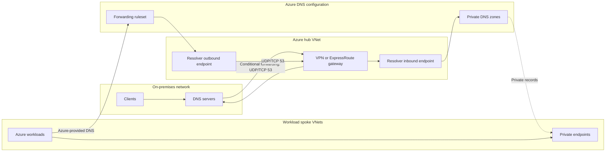
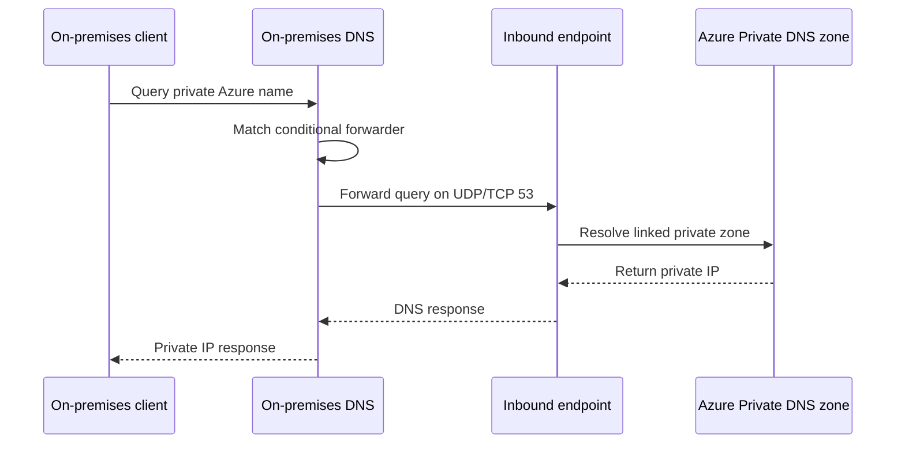
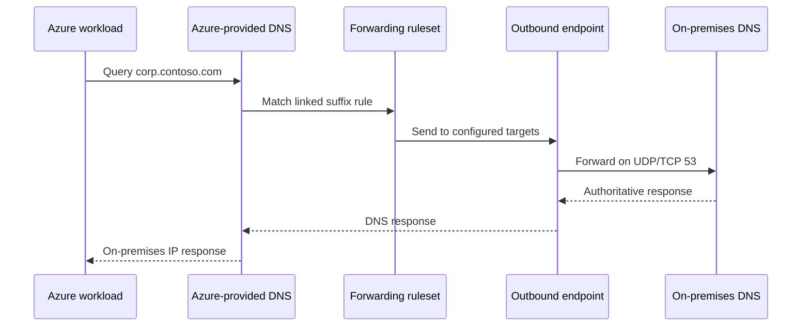
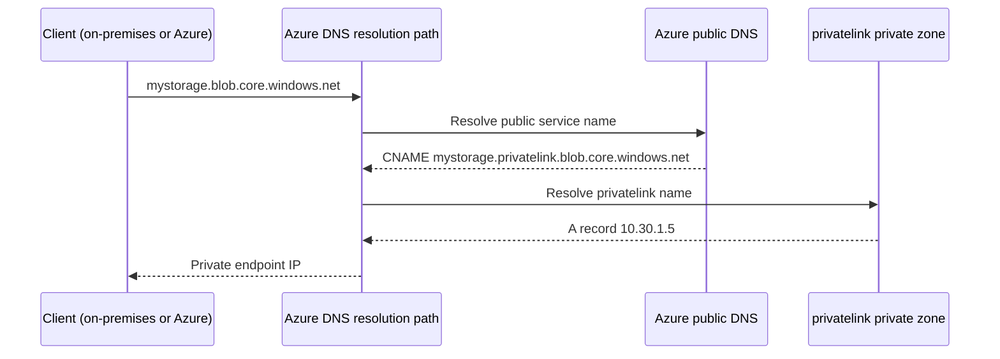
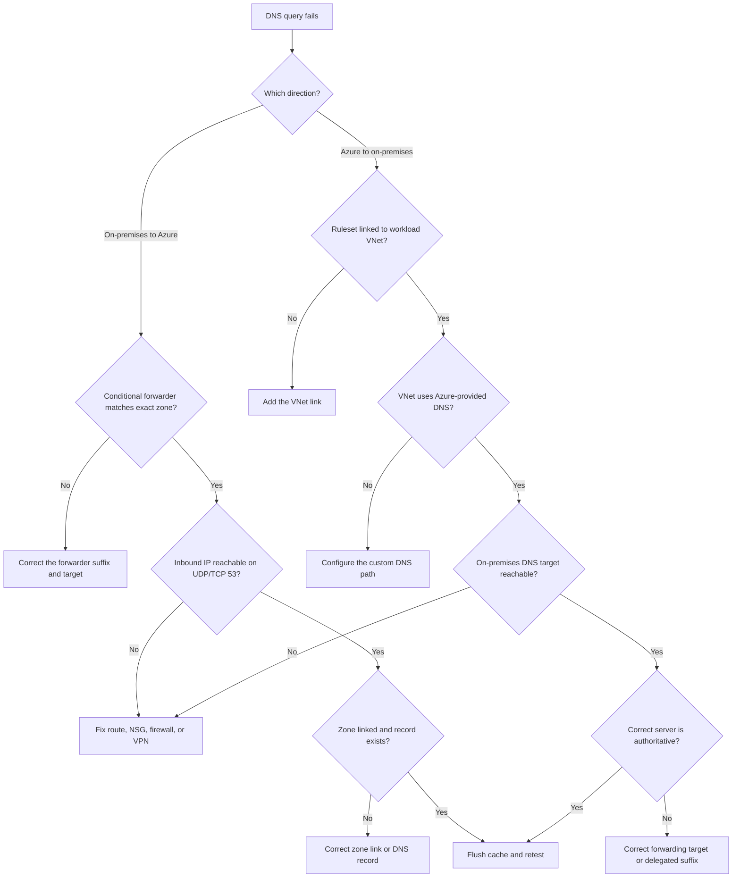

# Azure Private DNS Resolver Hybrid Runbook

This runbook describes how to configure Azure Private DNS Resolver for hybrid DNS resolution between on-premises networks and Azure hub-and-spoke virtual networks. It includes Azure portal steps, Windows DNS configuration, routing and firewall requirements, Azure workload considerations, validation, and rollback guidance.

## Outcomes

The completed design supports:

- On-premises clients resolving Azure Private DNS zones.
- Azure workloads resolving on-premises DNS zones.
- Azure workloads resolving private endpoints and on-premises names.
- Connectivity through Azure VPN Gateway or ExpressRoute.
- Centralized DNS forwarding without DNS forwarder virtual machines.

## Key concepts

| Component                 | Purpose                                                                         | Important behavior                                                                          |
| ------------------------- | ------------------------------------------------------------------------------- | ------------------------------------------------------------------------------------------- |
| Private DNS zone          | Holds private records for an application or Azure Private Endpoint              | A linked VNet can resolve records in the zone through Azure-provided DNS                    |
| VNet link                 | Makes a Private DNS zone or forwarding ruleset available to a VNet              | A zone link and a ruleset link have different purposes and are managed separately           |
| Inbound endpoint          | Receives DNS queries sent to Azure from on-premises or other reachable networks | Has an IP address that conditional forwarders can target                                    |
| Outbound endpoint         | Sends matching Azure DNS queries to external DNS servers                        | Is not queried directly and works through a forwarding ruleset                              |
| Forwarding ruleset        | Maps DNS suffixes to destination DNS servers                                    | Must be linked to each VNet that should use the rules when Azure-provided DNS is selected   |
| Conditional forwarder     | Sends queries for a specific suffix to another resolver                         | Configure exact authoritative suffixes to reduce loops and unintended forwarding            |
| Azure-provided DNS        | Azure recursive DNS service available at `168.63.129.16`                        | Linked Private DNS zones and forwarding rulesets are evaluated through this service         |
| Public DNS zone forwarder | The public service name clients actually query, such as `blob.core.windows.net` | This is the name on-premises conditional forwarders must target, not the `privatelink` name |
| CNAME chain               | Azure public DNS aliases the service name to its `privatelink` name             | The `privatelink` zone answers the final A record, so applications never change their FQDN  |

## Reference architecture

| Component                | Example                  |
| ------------------------ | ------------------------ |
| Hub VNet                 | `10.20.0.0/16`           |
| VPN Gateway subnet       | `10.20.0.0/27`           |
| Resolver inbound subnet  | `10.20.1.0/28`           |
| Inbound endpoint IP      | `10.20.1.4`              |
| Resolver outbound subnet | `10.20.1.16/28`          |
| Workload spoke           | `10.30.0.0/16`           |
| On-premises DNS servers  | `10.1.0.10`, `10.1.0.11` |
| On-premises domain       | `corp.contoso.com`       |



The DNS resolver handles name resolution only. VPN Gateway, ExpressRoute, peering, NSGs, UDRs, and private endpoints still provide the network path to the resolved private IP address.

## Resolution flows

### On-premises to Azure

1. An on-premises client queries its normal on-premises DNS server.
2. A conditional forwarder matches the Azure private DNS zone.
3. The on-premises DNS server sends the query to the resolver inbound endpoint.
4. Azure resolves the name from a Private DNS zone linked to the hub VNet.
5. The response follows the same path back to the client.



### Azure to on-premises

1. An Azure workload queries Azure-provided DNS.
2. A forwarding ruleset linked to the workload VNet matches the on-premises suffix.
3. The resolver outbound endpoint forwards the query to an on-premises DNS server.
4. The response returns over VPN or ExpressRoute.



The outbound endpoint does not expose an IP address that clients query directly. It sends queries only when a forwarding rule matches.

## 1. Prerequisites and planning

1. Confirm the hub, spoke, and on-premises address spaces do not overlap.
2. Confirm VPN Gateway or ExpressRoute connectivity is operational.
3. Confirm BGP or static routing advertises:
   - The hub resolver subnet prefixes to on-premises.
   - The on-premises DNS server prefixes to Azure.
4. Avoid advertising broad RFC1918 summaries unless every address in the summary follows the same route.
5. Select a regional hub. The resolver and its VNet must be in the same Azure region.
6. Reserve two dedicated subnets, normally `/28` or larger:
   - One subnet for inbound endpoints.
   - One subnet for outbound endpoints.
7. Do not place any other resources in the endpoint subnets.
8. Inventory:
   - Azure Private DNS zones.
   - Private endpoints and their required zone names.
   - On-premises DNS suffixes.
   - On-premises DNS server IP addresses.
   - VNets requiring on-premises name resolution.
9. Obtain `Network Contributor` and appropriate `Private DNS Zone Contributor` permissions.
10. Confirm that the `Microsoft.Network` resource provider is registered in the subscription.

### Responsibility boundaries

| Responsibility                                               | Typical owner                           |
| ------------------------------------------------------------ | --------------------------------------- |
| Hub VNet, delegated subnets, routing, and VPN/ExpressRoute   | Azure network team                      |
| Resolver, endpoints, rulesets, and VNet links                | Azure platform or DNS team              |
| On-premises conditional forwarders and authoritative records | Enterprise DNS team                     |
| Private endpoints and DNS zone groups                        | Application or platform team            |
| NSGs, firewall policy, and traffic inspection                | Network security team                   |
| End-to-end testing and service acceptance                    | Application owner with platform support |

Assign actual team names and escalation contacts during design. DNS configuration often spans several administrative boundaries even though the resolver itself is a single Azure service.

Reference: [What is Azure DNS Private Resolver?](https://learn.microsoft.com/en-us/azure/dns/dns-private-resolver-overview)

## 2. Create the endpoint subnets

In the Azure portal:

1. Open **Virtual networks**.
2. Select the hub VNet.
3. Select **Subnets**.
4. Select **+ Subnet**.
5. Enter `snet-dnspr-inbound`.
6. Assign a dedicated prefix such as `10.20.1.0/28`.
7. Under **Subnet delegation**, select `Microsoft.Network/dnsResolvers`.
8. Save the subnet.
9. Select **+ Subnet** again.
10. Enter `snet-dnspr-outbound`.
11. Assign a different prefix, such as `10.20.1.16/28`.
12. Apply the `Microsoft.Network/dnsResolvers` delegation.
13. Save the subnet.

Do not use any of the following for resolver endpoints:

- `GatewaySubnet`.
- `AzureFirewallSubnet`.
- A subnet delegated to another Azure service.
- A private endpoint subnet.
- A subnet containing virtual machines or other resources.

If NSGs or route tables are required by organizational policy, validate DNS traffic in both directions after association. UDRs must preserve routes between the outbound endpoint subnet and on-premises DNS servers.

## 3. Create the Azure DNS Private Resolver

1. Search the Azure portal for **DNS Private Resolvers**.
2. Select **+ Create**.
3. Select the subscription.
4. Select the networking resource group.
5. Enter a name such as `dnspr-hub-eastus2-01`.
6. Select the same region as the hub VNet.
7. Select the hub VNet.
8. Continue to **Inbound endpoints**.
9. Add an endpoint named `inbound-hub-01`.
10. Select `snet-dnspr-inbound`.
11. Select a static private IP when offered, such as `10.20.1.4`.
12. Continue to **Outbound endpoints**.
13. Add an endpoint named `outbound-hub-01`.
14. Select `snet-dnspr-outbound`.
15. Review and create the resolver.
16. Record the inbound endpoint IP address in the network design and DNS operations documentation.

Use a static inbound IP to keep on-premises conditional forwarders stable. The outbound endpoint does not require a client-facing IP address.

Reference: [Create an Azure DNS Private Resolver using the portal](https://learn.microsoft.com/en-us/azure/dns/dns-private-resolver-get-started-portal)

## 4. Configure Azure Private DNS zones

Create only the zones required by deployed private endpoints. Common examples include:

- `privatelink.blob.core.windows.net`
- `privatelink.dfs.core.windows.net`
- `privatelink.vaultcore.azure.net`
- `privatelink.database.windows.net`

For each zone:

1. Open **Private DNS zones**.
2. Create or select the zone.
3. Select **Virtual network links**.
4. Select **+ Add**.
5. Link the hub VNet.
6. Leave **Enable auto registration** disabled for Private Endpoint zones.
7. Link each consuming spoke VNet.
8. Create private endpoints with a **private DNS zone group** so Azure manages their DNS records.
9. Confirm the expected `A` records exist in the Private DNS zone.

Do not create broad private zones such as `core.windows.net` or `blob.core.windows.net`. Use the documented `privatelink` zone name. A broad authoritative zone can return `NXDOMAIN` for valid public Azure services.

For ADLS Gen2, configure both the `blob` and `dfs` private endpoints and zones when the workload uses both interfaces.

### Where to host the zones

Host all `privatelink` zones centrally in the connectivity or platform subscription, in a dedicated resource group such as `rg-connectivity-dns`.

- Create a single authoritative instance of each `privatelink` zone for the organization. Duplicate zones in multiple subscriptions cause split-brain resolution and stale records.
- Use Azure Policy, such as the built-in `Deploy-PrivateDNSZoneGroups` deploy-if-not-exists policies, to register every new private endpoint record into the central zone automatically.
- Link each zone to the hub VNet where the resolver lives. Clients that send queries to the inbound endpoint resolve through that link, so linking every zone to every spoke is only required for spokes resolving directly through Azure-provided DNS.

### How public names resolve to private IPs (CNAME chain)

Azure does not rename the service when a private endpoint is created. Azure public DNS adds a **CNAME** from the public service name to the corresponding `privatelink` name. The `privatelink` zone then supplies the final A record.

```text
mystorage.blob.core.windows.net
        |  CNAME, always present in Azure public DNS
        v
mystorage.privatelink.blob.core.windows.net
        |  A record in your private DNS zone
        v
10.30.1.5   private endpoint IP
```



What this means in practice:

- Clients always query the **public** service name. Connection strings and application configuration do not change.
- Whoever resolves the CNAME target decides the answer. When the `privatelink` zone is linked and reachable, the answer is the private IP. Without it, resolution falls back to the public IP.
- This is why on-premises conditional forwarders must target the **public** zone name. The resolver follows the CNAME and answers from the private zone.

Each service has a documented private zone name and a corresponding public zone forwarder. Some differ, so confirm both values per service.

| Service                   | Private DNS zone                    | Public DNS zone forwarder                       |
| ------------------------- | ----------------------------------- | ----------------------------------------------- |
| Blob storage              | `privatelink.blob.core.windows.net` | `blob.core.windows.net`                         |
| ADLS Gen2                 | `privatelink.dfs.core.windows.net`  | `dfs.core.windows.net`                          |
| Azure Files               | `privatelink.file.core.windows.net` | `file.core.windows.net`                         |
| Azure SQL Database        | `privatelink.database.windows.net`  | `database.windows.net`                          |
| Key Vault                 | `privatelink.vaultcore.azure.net`   | `vault.azure.net` and `vaultcore.azure.net`     |
| App Service and Functions | `privatelink.azurewebsites.net`     | `azurewebsites.net` and `scm.azurewebsites.net` |

Confirm the current values for every service in use, including sovereign cloud variants, in the Microsoft reference below.

Reference: [Azure Private Endpoint DNS configuration](https://learn.microsoft.com/en-us/azure/private-link/private-endpoint-dns) and [Private endpoint DNS integration scenarios](https://learn.microsoft.com/en-us/azure/private-link/private-endpoint-dns-integration)

## 5. Configure Azure-to-on-premises forwarding

1. Open the DNS Private Resolver.
2. Select **DNS forwarding rulesets**.
3. Create `dnsfrs-hub-eastus2-01`.
4. Associate the ruleset with `outbound-hub-01`.
5. Open the ruleset.
6. Select **Rules**.
7. Select **+ Add**.
8. Configure:
   - Name: `forward-corp-contoso`
   - Domain: `corp.contoso.com.`
   - Destination IP: `10.1.0.10`
   - Port: `53`
9. Add `10.1.0.11:53` as a second destination.
10. Enable the rule.
11. Add separate rules for other authoritative on-premises suffixes.
12. Select **Virtual network links**.
13. Link every workload VNet that needs on-premises resolution.
14. Link the hub if hub workloads need the same forwarding rules.

Use a trailing dot in forwarding-rule domains. Configure specific authoritative zones rather than `.`, `com.`, or an unnecessarily broad corporate parent namespace.

Add reverse lookup rules when Azure workloads need PTR resolution for on-premises IP ranges, for example `0.1.10.in-addr.arpa.` for `10.1.0.0/24`. Some enterprise applications and logging pipelines depend on reverse lookups.

Ruleset virtual network links are independent of VNet peering. A spoke can use the ruleset through its link even if it is not peered to the hub, though it still needs network reachability for the resolved destination.

Do not create a rule that forwards an Azure Private DNS zone to the resolver inbound endpoint while the same ruleset is linked to the resolver's hub VNet. That configuration can create a DNS loop.

References:

- [DNS Private Resolver endpoints and rulesets](https://learn.microsoft.com/en-us/azure/dns/private-resolver-endpoints-rulesets)
- [Private Resolver architecture](https://learn.microsoft.com/en-us/azure/dns/private-resolver-architecture)

## 6. Configure Windows DNS on-premises

Configure conditional forwarders on the on-premises DNS servers, targeting the resolver inbound endpoint IP.

Forward the **public** DNS zone name, such as `blob.core.windows.net`. Do not forward `privatelink.blob.core.windows.net`. Microsoft documents the public zone forwarder as the required target because Azure resolves the CNAME chain and returns the private IP.

| DNS zone to forward     | Forward to                   |
| ----------------------- | ---------------------------- |
| `blob.core.windows.net` | Resolver inbound endpoint IP |
| `dfs.core.windows.net`  | Resolver inbound endpoint IP |
| `database.windows.net`  | Resolver inbound endpoint IP |
| `vault.azure.net`       | Resolver inbound endpoint IP |
| `azurewebsites.net`     | Resolver inbound endpoint IP |

Create a forwarder only for the Azure services actually in use. Forwarding an unused public namespace sends avoidable query volume across the hybrid link.

### PowerShell

Run the following on a Windows DNS server with appropriate privileges:

```powershell
Add-DnsServerConditionalForwarderZone `
  -Name "blob.core.windows.net" `
  -MasterServers 10.20.1.4 `
  -ReplicationScope Forest

Add-DnsServerConditionalForwarderZone `
  -Name "dfs.core.windows.net" `
  -MasterServers 10.20.1.4 `
  -ReplicationScope Forest

Add-DnsServerConditionalForwarderZone `
  -Name "database.windows.net" `
  -MasterServers 10.20.1.4 `
  -ReplicationScope Forest
```

For a custom Azure private zone:

```powershell
Add-DnsServerConditionalForwarderZone `
  -Name "azure.contoso.com" `
  -MasterServers 10.20.1.4 `
  -ReplicationScope Forest
```

Select the replication scope that matches the Active Directory DNS design. If the forwarders are not AD-integrated, configure them on each recursive DNS server.

### DNS Manager

1. Open **DNS Manager**.
2. Expand the DNS server.
3. Right-click **Conditional Forwarders**.
4. Select **New Conditional Forwarder**.
5. Enter the public DNS zone forwarder name, such as `blob.core.windows.net`.
6. Add the resolver inbound endpoint IP, such as `10.20.1.4`.
7. Select **Store this conditional forwarder in Active Directory** if appropriate.
8. Select the required replication scope.
9. Repeat for every Azure service namespace required by on-premises clients.

Store the forwarders in Active Directory and replicate them so every domain controller resolves consistently.

Do not forward the on-premises authoritative zone to Azure when Azure already forwards that zone to on-premises. That creates a forwarding loop.

## 7. Configure routing and firewalls

Permit both UDP and TCP because DNS normally uses UDP but falls back to TCP for truncated or large responses.

| Source                   | Destination                  | Protocol and port |
| ------------------------ | ---------------------------- | ----------------- |
| On-premises DNS servers  | Resolver inbound endpoint IP | UDP 53 and TCP 53 |
| Resolver outbound subnet | On-premises DNS servers      | UDP 53 and TCP 53 |

Verify the following:

1. On-premises routing includes the resolver inbound subnet through VPN or ExpressRoute.
2. Azure routing includes the on-premises DNS prefixes.
3. VPN Gateway BGP propagation is enabled where appropriate.
4. Return traffic follows a valid path.
5. UDRs do not create an asymmetric route or DNS loop.
6. RFC1918 summary advertisements do not overlap Azure or partner networks.
7. Network appliances preserve UDP session state and permit TCP fallback.

Azure Firewall is not required for Azure DNS Private Resolver. If forced routing places Azure Firewall or another NVA in the path, add explicit network rules for UDP and TCP port 53. Do not enable Azure Firewall DNS Proxy unless it is deliberately part of the selected DNS architecture.

### Security and governance considerations

- Use exact DNS suffixes instead of broad forwarding rules.
- Apply least-privilege Azure RBAC separately to resolver, ruleset, and Private DNS zone administration.
- Use Azure Policy to govern approved private endpoint DNS zones and network configurations where appropriate.
- Treat DNS changes as production network changes because an incorrect link or rule can affect every workload in a VNet.
- Record the source, destination, protocol, and owner for each DNS firewall rule.
- Keep resolver endpoint subnets dedicated and prevent unrelated resource deployment.
- Review DNS TTLs before migrations; lower them in advance when a planned record change requires rapid convergence.
- Avoid using public DNS records to disclose internal hostnames or private addressing.
- Review current Azure DNS Private Resolver pricing and service limits when planning multiple regions or many rulesets.

## 8. Configure Azure workload VNets

The recommended distributed model is:

1. Keep each workload spoke VNet DNS setting at **Default (Azure-provided)**.
2. Link the DNS forwarding ruleset to each workload spoke that needs on-premises resolution.
3. Link required Private DNS zones to each consuming workload spoke.
4. Maintain hub-to-spoke peering.
5. Enable gateway transit and remote gateway use where a spoke reaches on-premises through the hub VPN Gateway.
6. Confirm that NSGs and UDRs permit the required data and DNS traffic.
7. Restart or renew the network configuration of existing workloads after changing VNet DNS server settings.

If a workload VNet uses custom DNS server IPs, linked forwarding rulesets do not replace those servers. The custom DNS servers must implement the forwarding path themselves.

## 9. Validate on-premises to Azure resolution

From an on-premises Windows host:

```powershell
Resolve-DnsName mystorage.blob.core.windows.net
Resolve-DnsName mydatabase.database.windows.net
Test-NetConnection 10.20.1.4 -Port 53
```

From an on-premises Linux host:

```bash
dig mystorage.blob.core.windows.net
dig azure.contoso.com
```

Expected results:

- The query is sent to the normal on-premises DNS server.
- The conditional forwarder sends the matching query to the inbound endpoint.
- Private endpoint names resolve to RFC1918 addresses.
- Public names continue to resolve normally.

`Test-NetConnection` validates TCP 53 only. Use an actual DNS query to validate UDP resolution.

## 10. Validate Azure to on-premises resolution

From an Azure VM, container host, or other workload:

```bash
nslookup server01.corp.contoso.com
nslookup mystorage.blob.core.windows.net
```

If diagnostic policy permits querying Azure-provided DNS directly:

```bash
dig @168.63.129.16 server01.corp.contoso.com
```

Validate all four cases:

1. On-premises to an Azure private name.
2. Azure to an on-premises private name.
3. Azure public-name resolution.
4. On-premises public-name resolution.

An `NXDOMAIN` response for a missing record in a linked Private DNS zone is authoritative. Azure does not fall back to public DNS for the same zone.

Reference: [What is the virtual IP address 168.63.129.16?](https://learn.microsoft.com/en-us/azure/virtual-network/what-is-ip-address-168-63-129-16)

## 11. High availability and disaster recovery

1. Use at least two on-premises DNS servers.
2. Configure both as targets in Azure forwarding rules.
3. Use a static inbound endpoint IP.
4. For regional disaster recovery, deploy another resolver in the secondary-region hub.
5. Add both regional inbound endpoint IPs to on-premises conditional forwarders.
6. Create regional outbound endpoints and rulesets for regional spokes.
7. Test failover by temporarily disabling one forwarding target during an approved maintenance window.
8. Do not make a secondary region dependent on a resolver hosted only in the primary region.
9. Review current service limits before a large multi-VNet deployment.

Reference: [Azure DNS service limits](https://learn.microsoft.com/en-us/azure/azure-resource-manager/management/azure-subscription-service-limits#azure-dns-limits)

## 12. Common failure modes

| Symptom                                                           | Likely cause                                                    | Corrective action                                                        |
| ----------------------------------------------------------------- | --------------------------------------------------------------- | ------------------------------------------------------------------------ |
| On-premises query times out                                       | Missing VPN route or port 53 rule                               | Validate routes and permit UDP/TCP 53 to the inbound IP                  |
| Azure cannot resolve an on-premises name                          | Missing rule, ruleset link, or return route                     | Validate the suffix, link, target IP, and VPN route                      |
| Private endpoint resolves publicly                                | Missing Private DNS zone link or zone record                    | Link the correct zone and configure the endpoint DNS zone group          |
| `blob` works but ADLS operations fail                             | Missing `dfs` endpoint or zone                                  | Configure both `blob` and `dfs` where required                           |
| Workload keeps old DNS behavior                                   | Workload cached DNS or predates a VNet DNS change               | Flush its cache, renew networking, or restart it                         |
| Queries loop until timeout                                        | Azure and on-premises forward the same zone to each other       | Restore clear authority and one-way forwarding per suffix                |
| Public Azure services return `NXDOMAIN`                           | An overly broad private zone was created                        | Remove the broad zone and use the documented `privatelink` zone          |
| On-premises resolves the public IP, Azure resolves the private IP | On-premises forwards `privatelink.*` instead of the public zone | Forward the public zone name so the resolver can follow the CNAME chain  |
| Only some private endpoints resolve from on-premises              | A forwarder exists for one service namespace but not others     | Add a conditional forwarder for each public zone in use                  |
| Ruleset does not affect a VNet                                    | VNet uses custom DNS servers                                    | Configure forwarding on the custom DNS servers or use Azure-provided DNS |
| Large DNS responses fail                                          | UDP works but TCP 53 is blocked                                 | Permit TCP 53 in both directions                                         |



## 13. Rollback procedure

If the implementation causes a production DNS issue:

1. Disable the affected forwarding rule instead of deleting the resolver.
2. Remove the new on-premises conditional forwarder.
3. Flush DNS caches on test clients and recursive DNS servers.
4. Remove the affected ruleset VNet link if Azure-to-on-premises forwarding is the source.
5. Restore the previous VNet DNS settings if they were changed.
6. Restart or renew networking on affected workloads after restoring VNet DNS settings.
7. Preserve the resolver and endpoint resources until the root cause is confirmed.

Example cache commands:

```powershell
Clear-DnsServerCache -Force
ipconfig /flushdns
```

```bash
sudo resolvectl flush-caches
```

## 14. Implementation checklist

- [ ] Address spaces are non-overlapping.
- [ ] VPN or ExpressRoute routing works in both directions.
- [ ] Dedicated inbound and outbound `/28` subnets exist.
- [ ] Both subnets are delegated to `Microsoft.Network/dnsResolvers`.
- [ ] The resolver and hub VNet are in the same region.
- [ ] The inbound endpoint uses a documented static IP.
- [ ] Required Private DNS zones and records exist.
- [ ] Private DNS zones are linked to the hub and consuming spokes.
- [ ] The outbound endpoint is associated with a forwarding ruleset.
- [ ] On-premises suffix rules have two DNS targets where available.
- [ ] The ruleset is linked to each consuming VNet.
- [ ] On-premises conditional forwarders target the inbound endpoint.
- [ ] On-premises conditional forwarders use public zone names, not `privatelink` names.
- [ ] Each `privatelink` zone exists once, hosted centrally in the connectivity subscription.
- [ ] Private endpoint DNS records are created automatically by DNS zone groups or Azure Policy.
- [ ] UDP and TCP port 53 are permitted in both directions.
- [ ] No circular forwarding rules exist.
- [ ] On-premises-to-Azure resolution has been tested.
- [ ] Azure-to-on-premises resolution has been tested.
- [ ] Public DNS resolution still works from both environments.
- [ ] Affected workloads have refreshed their DNS and network configuration after DNS changes.
- [ ] Secondary-region DNS behavior is documented and tested.

## References

- dmauser lab: [https://github.com/dmauser/azure-dns-private-resolver](https://github.com/dmauser/azure-dns-private-resolver)
- What is Azure DNS Private Resolver: [https://learn.microsoft.com/azure/dns/dns-private-resolver-overview](https://learn.microsoft.com/azure/dns/dns-private-resolver-overview)
- Endpoints and rulesets: [https://learn.microsoft.com/azure/dns/private-resolver-endpoints-rulesets](https://learn.microsoft.com/azure/dns/private-resolver-endpoints-rulesets)
- Hybrid DNS design: [https://learn.microsoft.com/azure/architecture/hybrid/hybrid-dns-infra](https://learn.microsoft.com/azure/architecture/hybrid/hybrid-dns-infra)
- CAF DNS for on-prem and Azure: [https://learn.microsoft.com/azure/cloud-adoption-framework/ready/azure-best-practices/dns-for-on-premises-and-azure-resources](https://learn.microsoft.com/azure/cloud-adoption-framework/ready/azure-best-practices/dns-for-on-premises-and-azure-resources)
- Create an Azure DNS Private Resolver using the Azure portal: [https://learn.microsoft.com/azure/dns/dns-private-resolver-get-started-portal](https://learn.microsoft.com/azure/dns/dns-private-resolver-get-started-portal)
- Azure DNS Private Resolver architecture: [https://learn.microsoft.com/azure/dns/private-resolver-architecture](https://learn.microsoft.com/azure/dns/private-resolver-architecture)
- Resolve Azure and on-premises domains: [https://learn.microsoft.com/azure/dns/private-resolver-hybrid-dns](https://learn.microsoft.com/azure/dns/private-resolver-hybrid-dns)
- Azure Private Endpoint DNS configuration: [https://learn.microsoft.com/azure/private-link/private-endpoint-dns](https://learn.microsoft.com/azure/private-link/private-endpoint-dns)
- Azure Private Endpoint DNS integration scenarios: [https://learn.microsoft.com/azure/private-link/private-endpoint-dns-integration](https://learn.microsoft.com/azure/private-link/private-endpoint-dns-integration)
- Private Link and DNS integration at scale: [https://learn.microsoft.com/azure/cloud-adoption-framework/ready/azure-best-practices/private-link-and-dns-integration-at-scale](https://learn.microsoft.com/azure/cloud-adoption-framework/ready/azure-best-practices/private-link-and-dns-integration-at-scale)
- Hub-spoke network topology in Azure: [https://learn.microsoft.com/azure/cloud-adoption-framework/ready/azure-best-practices/hub-spoke-network-topology](https://learn.microsoft.com/azure/cloud-adoption-framework/ready/azure-best-practices/hub-spoke-network-topology)
- Azure VPN Gateway design: [https://learn.microsoft.com/azure/vpn-gateway/design](https://learn.microsoft.com/azure/vpn-gateway/design)
- What is the virtual IP address 168.63.129.16: [https://learn.microsoft.com/azure/virtual-network/what-is-ip-address-168-63-129-16](https://learn.microsoft.com/azure/virtual-network/what-is-ip-address-168-63-129-16)
- Azure DNS service limits: [https://learn.microsoft.com/azure/azure-resource-manager/management/azure-subscription-service-limits#azure-dns-limits](https://learn.microsoft.com/azure/azure-resource-manager/management/azure-subscription-service-limits#azure-dns-limits)
