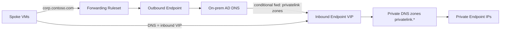

# Private DNS + DNS Private Resolver Runbook

Portal-based runbook for setting up Private DNS, an inbound resolver, and an
outbound resolver so Private Endpoints resolve in Azure and on-premises AD DNS
is reachable from Azure.

Based on Microsoft's hybrid-DNS best practices and dmauser's
[azure-dns-private-resolver](https://github.com/dmauser/azure-dns-private-resolver)
hub-and-spoke pattern. The resolver lives in the **hub** VNet; spokes and
on-prem point at it.

## Architecture (the flow)



- **Inbound endpoint** = on-prem -> Azure (resolves your `privatelink.*` zones).
- **Outbound endpoint + ruleset** = Azure -> on-prem AD (resolves `corp.contoso.com`).

## Placeholders to fill in

| Placeholder                 | Value                                    |
| --------------------------- | ---------------------------------------- |
| On-prem AD domain           | `corp.contoso.com`                       |
| On-prem AD DNS server IP(s) | `<onprem-dns-ip-1>`, `<onprem-dns-ip-2>` |
| Hub VNet                    | `<hub-vnet-name>`                        |
| Inbound endpoint VIP        | `<assigned-after-step-2>`                |

## Prereqs

- Hub VNet with connectivity (VPN/ExpressRoute) to on-prem.
- Two **dedicated empty subnets** in the hub, each **/28 minimum** (Microsoft
  recommends /26 for headroom). No other resources allowed; they are delegated
  to `Microsoft.Network/dnsResolvers`. Suggested names:
  `snet-dnspr-inbound`, `snet-dnspr-outbound`.

## 1. Create the DNS Private Resolver

Portal -> **DNS Private Resolvers** -> **Create** -> pick subscription/RG,
region (same as hub VNet), select the **hub VNet**.

## 2. Inbound endpoint

On the resolver's **Inbound endpoints** tab -> **Add** -> select
`snet-dnspr-inbound`, IP assignment **Dynamic** (or Static). Note the assigned
**inbound VIP** — you reuse it everywhere. (Portal delegates the subnet
automatically.)

## 3. Outbound endpoint

**Outbound endpoints** tab -> **Add** -> select `snet-dnspr-outbound`.

## 4. DNS forwarding ruleset (Azure -> on-prem)

**DNS forwarding rulesets** -> **Create** -> attach the **outbound endpoint**
from step 3. Then add a rule:

- **Domain name:** `corp.contoso.com.` (your AD domain, trailing dot)
- **Destination IP(s):** your on-prem AD DNS server IP(s)
- **State:** Enabled

Add rules for any reverse zones (`x.x.x.in-addr.arpa.`) if you need PTR to
on-prem.

**Link the ruleset** to the hub VNet (and each spoke VNet that needs on-prem
resolution) under the ruleset's **Virtual Network Links**.

## 5. Private DNS zones for Private Endpoints

### Where the zones should live (best practice)

Per the Cloud Adoption Framework, host all `privatelink.*` zones **centrally in
the connectivity (hub / platform) subscription**, in a dedicated resource group
(for example `rg-connectivity-dns`) — **not** in each workload/spoke
subscription. Rationale:

- **One authoritative copy per zone.** Create a single instance of each
  `privatelink.*` zone for the whole org. Do not duplicate the same zone in
  multiple subscriptions — duplicates cause split-brain and stale records.
- **Central control + Azure Policy.** Use the built-in
  `Deploy-PrivateDNSZoneGroups` / `DINE` policies to automatically register
  every new Private Endpoint's A record into the central zone, so workload teams
  can't accidentally create their own zones.
- **Resolution reaches it via the resolver, not per-zone links.** Because the
  zones are linked to the **hub VNet where the resolver lives**, the inbound
  endpoint answers privatelink queries for all spokes and on-prem — you do not
  need to link every zone to every spoke VNet.

### Create the zones

For each PaaS service, create the matching `privatelink.*` zone (for example
`privatelink.blob.core.windows.net`, `privatelink.database.windows.net`,
`privatelink.vaultcore.azure.net`). Portal -> **Private DNS zones** ->
**Create**, placing them in the central connectivity RG above.

For each zone -> **Virtual network links** -> add a link to the **hub VNet**
(where the resolver lives). This lets the inbound endpoint answer privatelink
queries for every client that points at the inbound VIP (spokes and on-prem).
Only add links to individual spoke VNets if a spoke uses Azure default DNS
(168.63.129.16) directly instead of the resolver.

Zone reference (per-service zone names):
<https://learn.microsoft.com/azure/private-link/private-endpoint-dns>

## 6. Wire up Private Endpoints

When creating each Private Endpoint, on the **DNS** tab choose **Integrate with
private DNS zone -> Yes** and select the matching zone. This auto-creates the A
record. (For existing PEs, add the A record or re-run the zone group.)

## 7. Point clients at the resolver

- **Spoke VNets:** VNet -> **DNS servers** -> **Custom** -> enter the **inbound
  endpoint VIP**. Restart/reapply on VMs (renew DHCP lease).
- **On-prem AD DNS:** add **conditional forwarders** pointing to the **inbound
  endpoint VIP** (see next section for exactly which names).

## 8. On-premises configuration (AD DNS forwarders)

On each on-premises AD DNS server (DNS Manager -> **Conditional Forwarders** ->
**New Conditional Forwarder**), create one forwarder per Azure PaaS namespace,
all pointing to the **inbound endpoint VIP** from step 2. Use the **public**
zone name, not the `privatelink.` name — the CNAME chain (next section) does the
translation for you.

| DNS domain (public zone)          | Forward to               |
| --------------------------------- | ------------------------ |
| `blob.core.windows.net`           | `<inbound-endpoint-VIP>` |
| `database.windows.net`            | `<inbound-endpoint-VIP>` |
| `vaultcore.azure.net`             | `<inbound-endpoint-VIP>` |
| `azurewebsites.net` (App Service) | `<inbound-endpoint-VIP>` |

Notes / best practice:

- **Forward the public zone, not `privatelink.*`.** On-prem sends the public
  name; Azure resolves the CNAME to `privatelink.*` and returns the private IP.
- Store the conditional forwarders in **Active Directory** and replicate to all
  DNS servers in the forest/domain so every DC resolves consistently.
- Ensure the inbound VIP is reachable over your VPN/ExpressRoute (UDP/TCP 53 and
  any NSG/firewall rules allow on-prem subnets -> inbound endpoint subnet).
- If Azure also needs to resolve on-prem names, that is handled by the
  **outbound endpoint + ruleset** from step 4 (Azure -> on-prem `corp.contoso.com`).

## 9. How the public URL translates to a private IP (CNAME chain)

Azure never renames the service; it uses a **CNAME chain**. When a Private
Endpoint is created, the public FQDN is CNAME'd to a `privatelink.*` name, which
is what your private DNS zone answers.

Example for a storage account `mystorage`:

```text
mystorage.blob.core.windows.net
        │  (public CNAME, always present in Azure public DNS)
        ▼
mystorage.privatelink.blob.core.windows.net
        │  (A record in your private DNS zone -> Private Endpoint NIC IP)
        ▼
10.x.x.x   (private IP)
```

What this means in practice:

- Clients (spoke VMs **and** on-prem) always query the **public** URL
  (`mystorage.blob.core.windows.net`) — the app/connection string never
  changes.
- Public Azure DNS returns the CNAME `...privatelink.blob.core.windows.net`.
- Whoever resolves that CNAME next decides the answer:
  - **With** the private DNS zone linked to the resolver's VNet -> the A record
    resolves to the **private** Private Endpoint IP. ✅
  - **Without** the private zone -> it falls through to the public IP. ❌
- This is why on-prem forwards the **public** zone to the inbound VIP: the
  resolver walks the CNAME and answers from the private zone with the private
  IP. No `privatelink` forwarder is required on-prem.

## Validation

- From a spoke VM: `nslookup <account>.blob.core.windows.net` -> returns the
  **private** IP.
- From a spoke VM: `nslookup dc01.corp.contoso.com` -> resolves via on-prem.
- From on-prem: `nslookup <account>.blob.core.windows.net` -> returns the
  private IP.

## Key gotchas

- Inbound/outbound subnets must stay empty and be `/28` or larger.
- `privatelink.*` zones must be linked to the resolver's (hub) VNet.
- Don't forget on-prem conditional forwarders for the **public** service names
  (they CNAME to `privatelink.*`).
- A VNet linked to a forwarding ruleset does **not** need to be peered with the
  resolver VNet — ruleset links work independently of peering.

## References

- dmauser lab: <https://github.com/dmauser/azure-dns-private-resolver>
- What is Azure DNS Private Resolver:
  <https://learn.microsoft.com/azure/dns/dns-private-resolver-overview>
- Endpoints and rulesets:
  <https://learn.microsoft.com/azure/dns/private-resolver-endpoints-rulesets>
- Hybrid DNS design:
  <https://learn.microsoft.com/azure/architecture/hybrid/hybrid-dns-infra>
- CAF DNS for on-prem and Azure:
  <https://learn.microsoft.com/azure/cloud-adoption-framework/ready/azure-best-practices/dns-for-on-premises-and-azure-resources>
